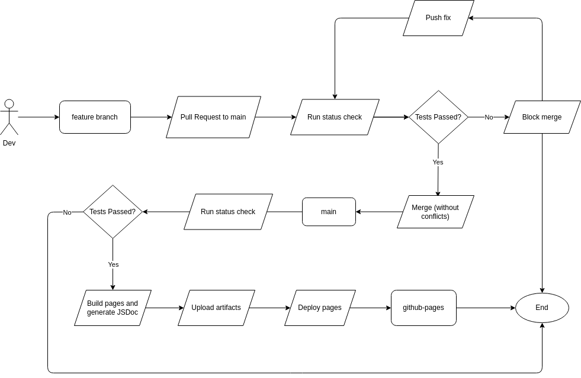

# Phase 1

## Status

The following diagram shows our current CI/CD pipeline:

## How it works

The pipeline is built using GitHub Actions and is broken up into two workflows:

1. Build
2. Build and Deploy

_Build_ is triggered and used as a status check when a new pull request to the
`main` branch from a `feature` branch is opened (or reopened). This workflow
ensures the code is formatted and linted[^1] and passses all tests before it can
be merged into the `main` branch.

Once a `feature` branch is merged into `main`, the _Build and Deploy_ workflow
is triggered. This workflow reuses the _Build_ workflow to ensure the code is
still in good shape. If the Build workflow passes, the code is then documented
using JSDoc and the documentation is deployed into a separate `production`
branch, which has been set up to be hosted as a GitHub Pages site.

> **NOTE:** The _Build and Deploy_ workflow is currently triggered on every push
> to the `main` branch. Ideally, we want to only trigger this workflow when
> a new pull request is merged (or maybe only on release, TBD). This will be
> implemented in Phase 2. Also, in the future, the `main` branch will be closed
> to direct pushes and will only be updated through pull requests, with very few
> exceptions[^2].

## What works

- [x] Build
  - [x] Code linting and formatting
    - [x] ESLint
    - [x] Prettier
    - [x] Stylelint
  - [x] Unit testing
- [x] Deploy
  - [x] Build repo pages with Jekyll to support markdown files as index
  - [x] JSDoc generation
  - [x] Deployment to GitHub Pages

[^1]: We are using ESLint + Prettier + Stylelint to lint and format our code
    using the ESLint [Google JavaScript Style
    Guide](https://google.github.io/styleguide/jsguide.html). **Note that code
    linting/formatting errors that aren't automatically fixed will also return
    an error to the pipeline and block the build-deploy process.**

[^2]: Admin users will be able to push directly to `main` for hotfixes and
    emergency patches.. This will be implemented in Phase 2. Also, since we
    store our admin documentation in this repository, team leads and the planner
    will be able to push directly to `main` to update non-code files. Force
    pushes will also only be allowed for these users.
