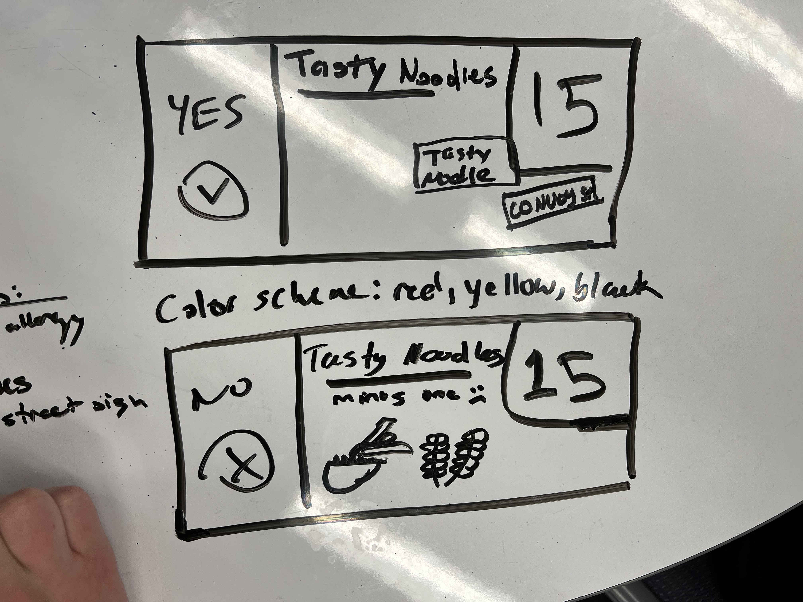

# Tasty Noodles Meeting Minuites 04/18/2023

## Meeting Details

- Type: Kickoff
- Start Time: 06:30
- End Time: 07:25
- Location: 1st Floor Geisel

### Attendees

- [x] Mark Lucernas
- [x] Hieu Pham
- [x] Darren Yu
- [x] Runhui Wang
- [x] Xinle Yu
- [x] Anthony Yao
- [x] Yue(Steve) Yin
- [ ] Holly Zhu
- [x] Aaron Kann

## Agenda

### Unresolved Business

1. N/A

### Today's Business

1. Team Contract
2. Team Name (Tasty Noodles)
3. Brainstorming Poster Designs
4. Discuss Video Ideas

### Future Business

1. Finish Up The Poster (AKA Outline + Color)
2. Finish Up Team Intro Video

## Decisions Made & Reasoning

- Rules were set up and responsibilities were assigned for each team member ([Link to Contract](../misc/rules.pdf))
- We decided to name ourselves "**Tasty Noodles**"
- Some poster designs:
    - 
- Make a 10 second clip of each member introducing each other for the team introduction video. Format to answer: Your name,your team position, and your favorite noodle. Example: `Hello everyone, my name is John Doe and I'm a developer for team Tasty Noodle. My favorite noodle is [blank].`
