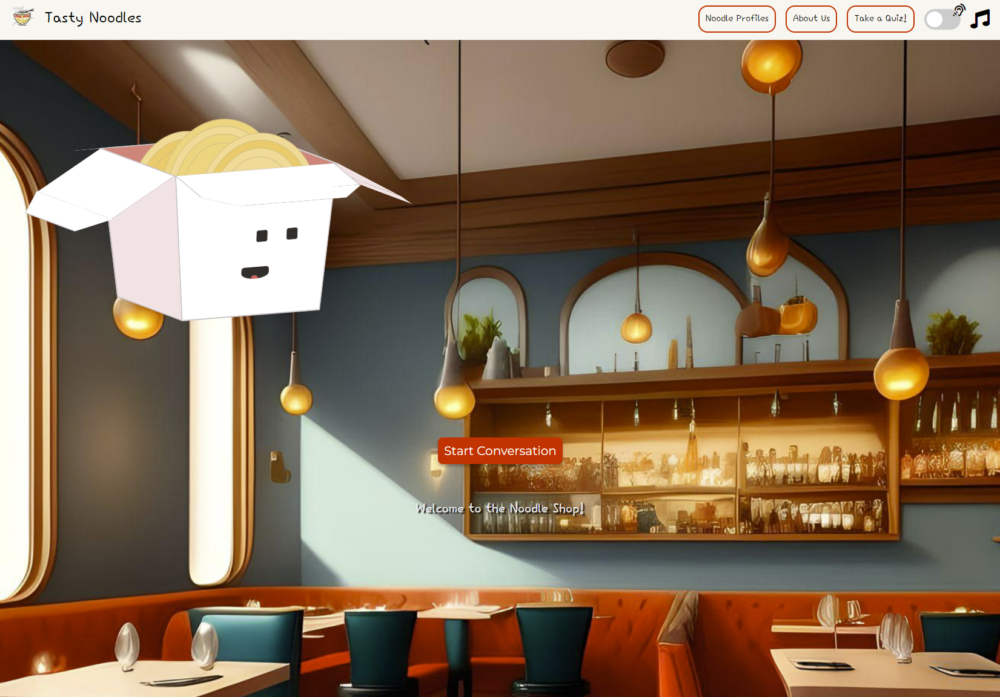

# Noodle Horoscope

Welcome to Noodle Horoscope! This is a web application that generates
a horoscope based on your noodle profile inspired by zodiac signs. Our app
offers carefully crafted daily horoscopes that are tailored to your unique
noodle personality which is determined by your answers to our questionnaire.



## Dependencies

- [node.js](https://nodejs.org/en/) (v18.\*)
- [JSDoc](https://jsdoc.app/)
- [ESLint](https://eslint.org/)
- [Prettier](https://prettier.io/)

```bash
# IMPORTANT: Install dependencies

# By default npm install will execute `npm run prepare` script which will
# install `husky` for git hooks used to auto-format files in git staging before
# every commits.

cd ./fortunetelling
npm install
```

## Development

[Fortunetelling documentation pages](https://cse110-sp23-group15.github.io/cse110-sp23-group15/fortunetelling/docs/index.html) for project code documentation.

## TL;DR

### Git Workflow

1. Create a new branch from `main` branch
2. Make changes to your branch
    - Make sure to test your code before committing. Fix all errors if any.
      Warnings are okay.
        ```bash
        # cd ./fortunetelling
        npm run test
        ```
    - Make sure to include JSDoc comments for all functions. See
      [examples](https://jsdoc.app/howto-es2015-modules.html).
        - Make sure to generate JSDoc pages before committing to check for
          missing documentation. JSDoc output will get ignored by git since
          `main` branch workflow trigger will auto-generate JSDoc pages and
          deploy to GitHub pages.
            ```bash
            # Cd ./fortunetelling
            npm run docgen
            ```
    - **OPTIONAL:** Although we have `husky` and `lint-staged` setup to
      auto-format all files in staging on `git commit`, it is a good idea to run
      our linting/formatting script to make sure our code is properly formatted
      before committing.
        ```bash
        # cd ./fortunetelling
        npm run format
        ``
3. Commit changes to your branch
    - **NOTE:** We have `husky` and `lint-staged` setup to auto-format all files
      in git staging on `git commit`. This means that you don't have to worry
      about formatting your code before committing.
4. Push changes to your branch
5. Create a pull request (PR) to merge your branch to `main` branch
6. Wait for CI pipeline to pass
    - If status check failed, fix errors and repeat steps 3-5
8. Request review from at least one other team lead/team member
7. Merge PR to `main` branch

### Project Structure

```
.
├── index.html
├── node_modules
├── ...
└── src
    ├── css
    │   ├── main.css
    │   └── ...
    ├── img
    │   ├── favicon.ico
    │   ├── icon.png
    │   ├── ramen-icon-1.png
    │   └── ...
    ├── js
    │   ├── database
    │   │   ├── horoscopeDB.json
    │   │   └── ...
    │   ├── genHoroscope.js
    │   ├── main.js
    │   └── ...
    ├── pages
    │   ├── about.html
    │   ├── profiles.html
    │   ├── questionnaire.html
    │   └── ...
    └── sounds
        ├── bg-music.wav
        └── ...
```

### Code Linting

It is important to lint and format your code before committing to the
repository. Simply run the following to lint files in the `src` directory:

```bash
# cd ./fortunetelling
npm run format
```

> NOTE: Make sure to fix all linting errors before committing as well because
> merging PRs with linting errors will be blocked by our CI pipeline.

### Testing

More than anything else, testing your code is non-negotiable. It follows that
your code should be testable and that prior to merging PRs, all tests should
pass. To run tests, simply run the following:

```bash
# cd ./fortunetelling
npm run test
```

> NOTE: Failed tests will block merging PRs.

### Manual JSDoc Generation

To generate JSDoc manually, simply run the following (make sure to exclude
output from git commit changes):

```bash
# cd ./fortunetelling
npm run docgen

# Open JSDoc in your browser
open ./docs/index.html
```

> NOTE: This will generate JSDoc in the `./fortunetelling/docs` directory and
> will be ignored by git since `main` branch worflow trigger will auto-generate
> JSDoc pages and deploy to GitHub pages.

### Environment

#### Recommended setup for dev environment (you can use other method you prefer)

**Requirements:**

- `npm`

**Installation:**

```bash
# Install browser-sync globally
npm install -g browser-sync
```

**Usage:**

```bash
# Make sure you are in the root directory of the project
cd cse110-sp23-group15

# Start live server. Your browser window will auto-open http://localhost:3000
# that watches for all file changes from the current directory recursively and
# auto-reload the page when changes are detected.
browser-sync start --server --files "**/*"
```

See [BrowserSync](https://browsersync.io/) for more details.
