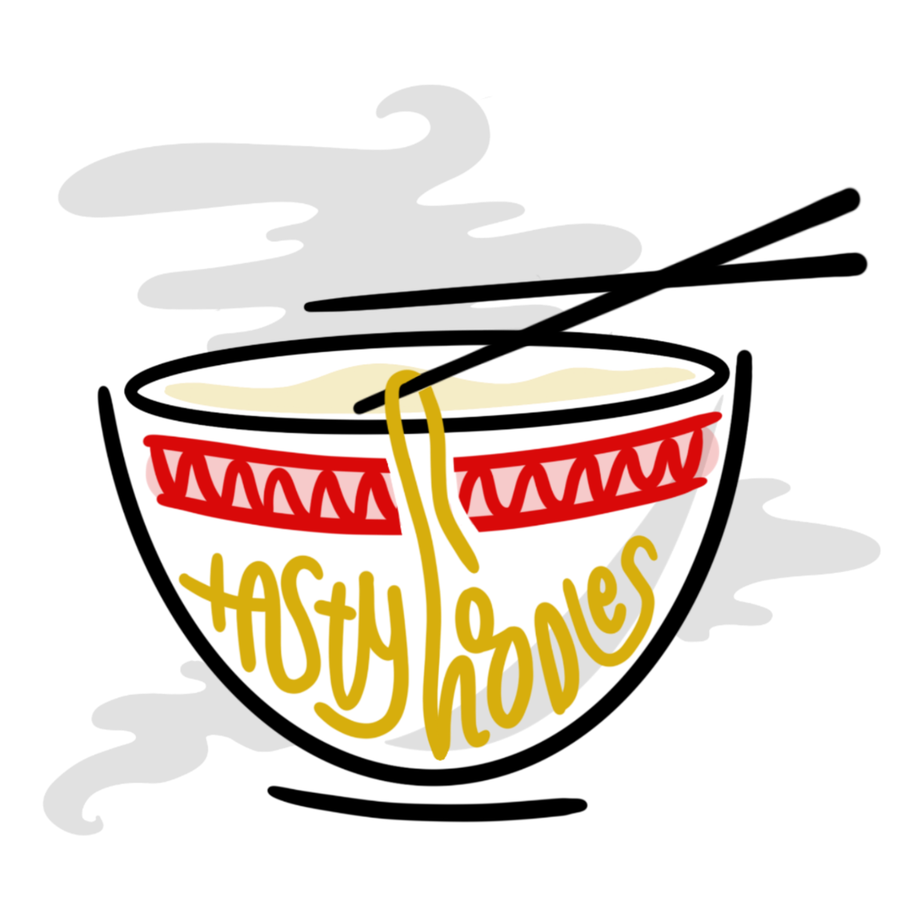
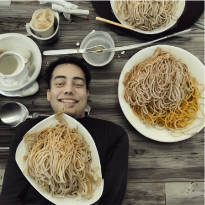
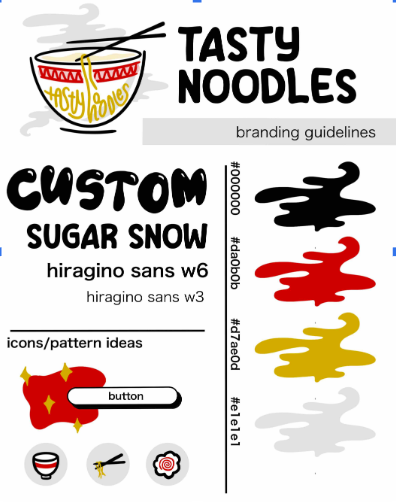
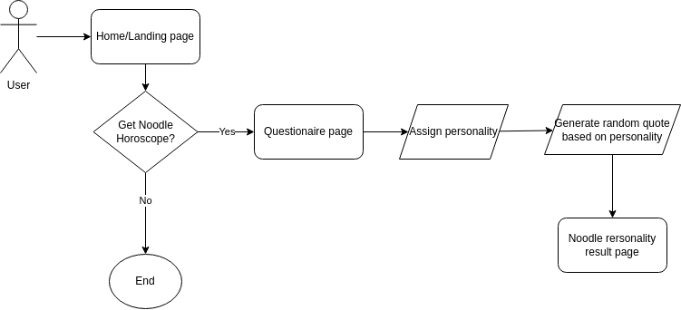

<h1 align="center">Noodle Horoscope</h1>

<h1 align="center">By Tasty Noodles (Team 15)</h1>

  

<h1 align="center">Statement of Purpose</h1>

Noodle Horoscope, a fortune telling web app for noodle-lovers that gives you a noodle-themed horoscope and general
life advices according to your “noodle” sign. Our mission is to serve as a fun and insightful destination for those
seeking guidance and inspiration. Our website is designed to create a relaxed, bright, warm, fun and interactive
webpage for the users to feel comfortable and rest assured about their fortune.

<h1 align="center">Who, What, When, Where, Why, How?</h1>

**Who:** Any noodle-lover, noodle-curious, noodle-woke, or noodle-inclined individuals seeking for some general life advices. TODO: more targeted user

**What:** The wisdom of noodles will tell you your fate.

**When:** Anytime anyone need an advice at convenience.

**Where:** Desktop or mobile browser (with internet access).

**Why:** Because why not? Noodles and horoscope is the perfect crossover people have been waiting for.

**How:** Will give a series of questions to determine the
user’s “noodle personality” which will then be matched to its corresponding horoscopic noodle-sign. Once a personality is assigned, the user will then get their personalized daily noodle horoscope.

<h1 align="center">User Personas</h1>

<h2 align="center">Jimmy - Noodle Enthusiast</h2>

**Background:** Jimmy is a 35-year-old food blogger and avid traveler who fell in love with noodles during his culinary adventures across Asia, experiencing the diverse flavors and techniques associated with different noodle dishes.

**Goals:** Jimmy's goal is to explore and document the world of noodles, seeking out hidden gems and lesser-known noodle varieties to share with his audience and expand his own culinary knowledge.

**Skillset:** With a refined palate and a talent for storytelling, Jimmy has the ability to capture the essence of noodle dishes through his vivid descriptions and enticing food photography.

**Needs:** Jimmy requires access to authentic noodle restaurants, local food markets, and connections with noodle enthusiasts to continue his culinary exploration and expand his network in the food blogging community.

<h2 align="center">Anita - Yoga Instructor</h2>

**Background:** Anita is a 27-year-old yoga instructor and freelance writer who developed a deep appreciation for both noodles and horoscopes during her travels in Southeast Asia, where she discovered the harmonious connection between food
and astrology.

**Goals:** Anita's goal is to combine her passion for noodles and astrology by creating a blog that explores the astrological significance of different noodle dishes, providing readers with a unique perspective on the intersection of food and
spirituality.

**Skillset:** With her knowledge of astrology and strong writing skills, Anita has the ability to convey the mystical and gastronomic elements of noodle-based cuisines, offering engaging and informative content to her readers.

**Needs:** Anita seeks reliable sources of information on astrology and access to a variety of noodle recipes and cultural insights to enrich her blog posts and further explore the intertwining worlds of noodles and horoscopes.

<h2 align="center">Jenny- College Student</h2>

**Background:** Jenny is a 21-year-old college student pursuing a degree in business administration. She grew up in a small town where she was exposed to limited culinary diversity, but her recent move to a more vibrant city has ignited her interest in exploring new food experiences, particularly with noodles.

**Goals:** Jenny's goal is to broaden her culinary horizons and develop a repertoire of delicious noodle recipes that she can prepare on a student budget, satisfying her cravings while balancing her studies.

**Skillset:** With a keen interest in cooking and a knack for adapting recipes, Jenny is adept at finding creative ways to make budget-friendly and tasty noodle dishes using readily available ingredients.

**Needs:** Jenny is looking for easy-to-follow noodle recipes, budget-friendly cooking tips, and suggestions for affordable places to buy specialty ingredients to support her exploration of diverse noodle cuisines without breaking the bank.

<h1 align="center">Risks and Rabbit Holes</h1>

- Having too much/few animations and getting the right ones for best UX
    - May require us to use unfamiliar tools
- Color schemes (visuals)
    - Since our branding is noodle-themed, it will be a challenge to create pleasing color schemes to match
       our app’s intended ambiance (calm, tasty, fun, horoscopic, etc.)
- Creating an effective personality test.
- Update the fortunes daily while keeping them unique and relevant to the user.
- Assigning personalities to a noodle dish while maintaining culturally sensitivity.
- User authentication to save user states. Somewhat difficult for a static website.
    - Alternatives: Local storage. Progressive webapp
- Risk of people believing too much on the result of their personality test and
    horoscope/quotes

<h1 align="center">Requirements and Specifications</h1>

- A visually appealing, easy to navigate interface
- A set of 12 fortunes that automatically change every day
- A fun and reasonably short personality quiz to determine noodle type
- 12 unique personality descriptions for the noodle types
- Lucky number / color / compatible noodle generator alongside the fortune
    (should)
- Profile system (nice to have)
- Voice Reader (nice to have)

<h1 align="center">Wireframe</h1>

[Figma wireframe (view-only)](https://www.figma.com/file/xMDGw4FwyA8KfdYPyGJekg/Magic-8-Ball-Wireframe?type=design&node-id=0%3A1&t=c7xa4mWMXEJiVEdP-1)

<h1 align="center">Styling Guidelines</h1>

  

- [branding sheet](../admin/branding/branding-sheet.pdf)

<h1 align="center">Systems Diagram</h1>

  

<h1 align="center">Project Roadmap</h1>

**Phase 1: Barebones Implementation**

- Create pages (mobile-first, vanilla CSS first)
    - Landing
    - Questionnaire
    - Noodle Profiles
    - About Us
- Create asset files
    - Art for 12 noodle horoscope profiles
- Implement basic page functionalities
    - Button, redirection, navigation, etc.
- Compile list of daily horoscope for all 12 profiles
- Testing framework

**Phase 2: Improve UI/UX**

- Add element animations
- Add sound effects
- Improve page cohesiveness
    - Page transitions, etc.
- A11Y R&D
    - [https://www.a11yproject.com/](https://www.a11yproject.com/)

**Phase 3: Accessibility**

- Add voice reader (contingent upon A11Y R&D)
    - A11Y [https://www.a11yproject.com/](https://www.a11yproject.com/)
- Light/Dark Theme?
    - [https://developer.mozilla.org/en-US/docs/Web/CSS/@media/prefers-color-scheme](https://developer.mozilla.org/en-US/docs/Web/CSS/@media/prefers-color-scheme)
- Dynamic font size (tentative)

**Phase 4: Finalize/Last Minute Features**

- Fix Remaining bugs
- Polish UI/UX
- Documentations (done side-by-side)
    - JSDoc
    - Wiki
    - Client-side FAQ page

If time permits:

- Basic user authentication
    - Add login and register page
    - Cache user noodle personality for returning users

